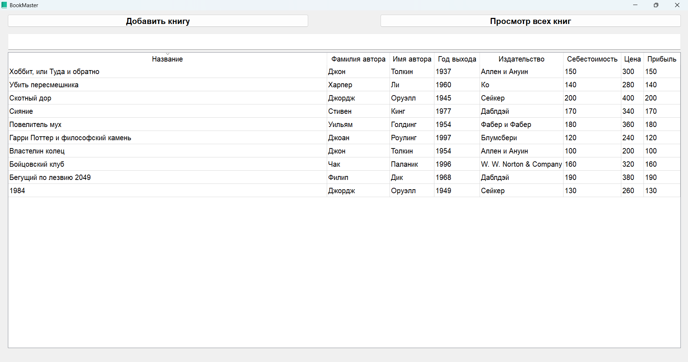
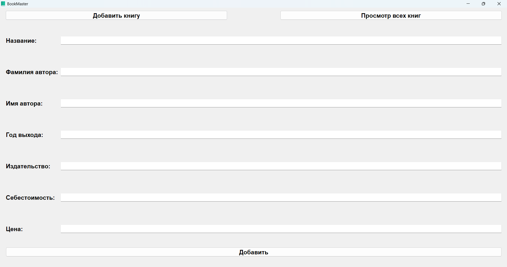
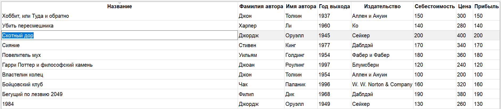
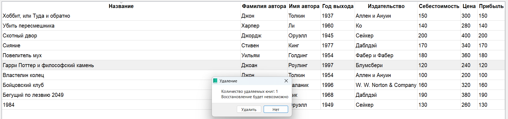

<div align="center">
<h2>
Qt-based Book Management Application (BookMaster)
</h2>
</div>

## О проекте

Этот проект представляет собой приложение для управления книгами, которое позволяет пользователям добавлять, просматривать и редактировать информацию о книгах.

## Пример работы программы

При запуске приложения по умолчанию открывается вкладка **"Просмотр всех книг"**.


<br>
| _Главное окно программы_


<br>
| _Окно добавления книги_

Для ___редактирования___ книги необходимо ___нажать___ мышкой ___на нужную книгу___ два раза, после чего можно вводить новое значение.


<br>
| _Окно редактирования книги_

Для ___удаления___ книги необходимо ___нажать___ мышкой ___на нужную книгу___ и нажать кнопку **"Del"** на клавиатуре устройства.


<br>
| _Окно удаления книги_

## Технологический стек
Версия Qt: `Qt 4.x`

Используемые библиотеки:
```
QtWidgets
QtGui
QtCore
```

## Установка
Для установки и запуска проекта выполните следующие команды:
```bash
git clone https://github.com/gleb7499/course_project_3_term.git
```

## Использование
Откройте файл [BookMaster.pro](/BookMaster/BookMaster.pro) в [Qt Creator](https://github.com/qt-creator/qt-creator/releases), соберите и запустите проект.

## Лицензия
Данный проект распространяется под [лицензией](LICENSE) MIT.

## Автор
Проект разработан [Логиновым Глебом Олеговичем](https://github.com/gleb7499/).
